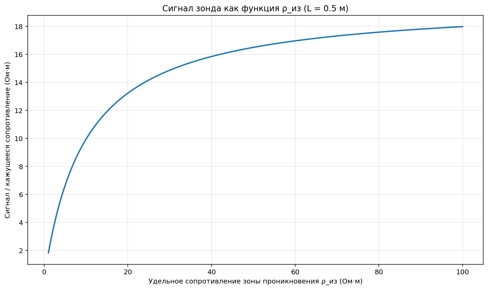
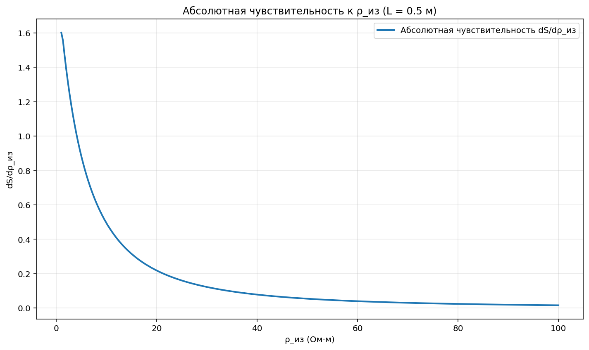
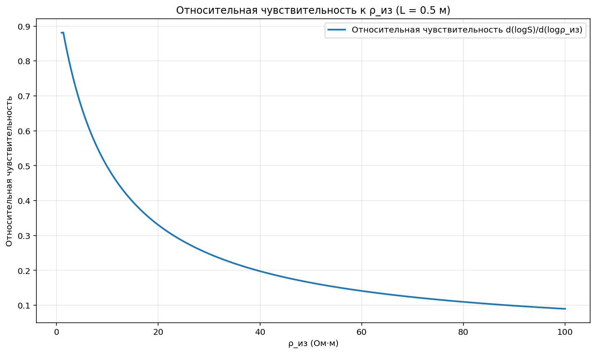
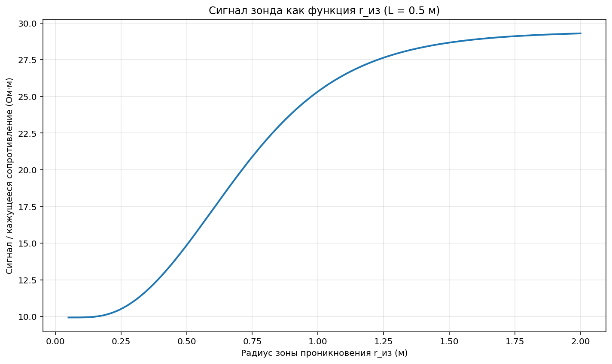
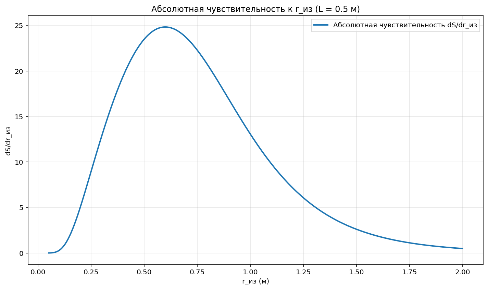
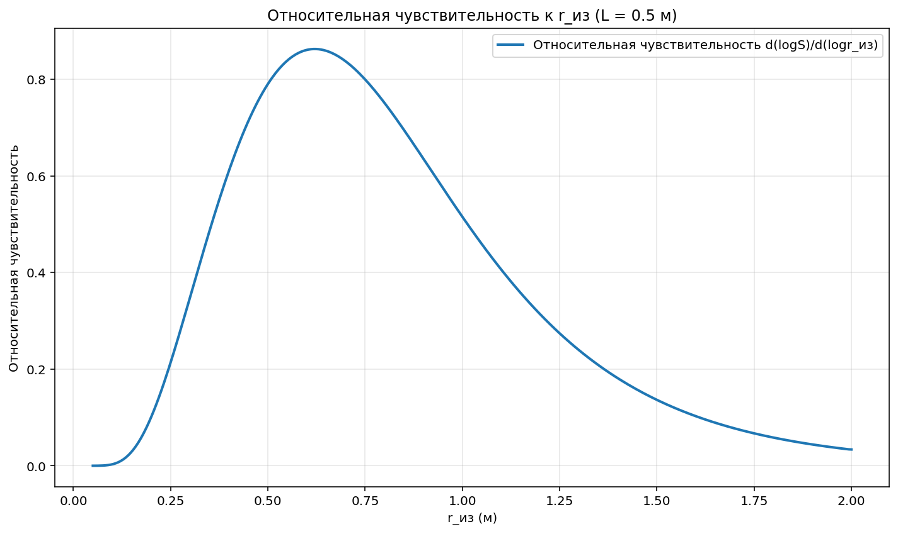
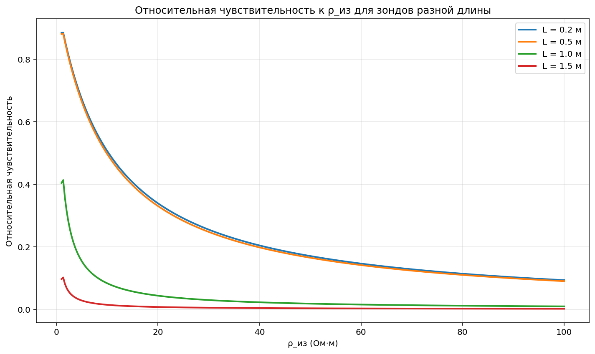
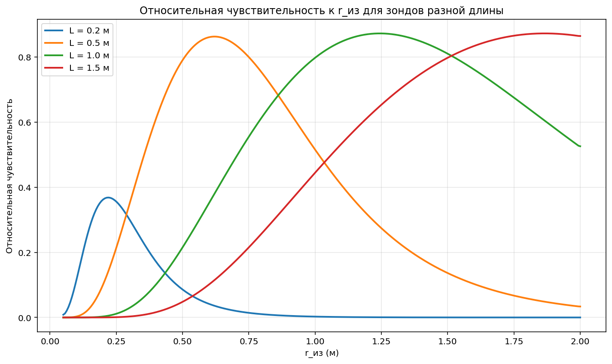
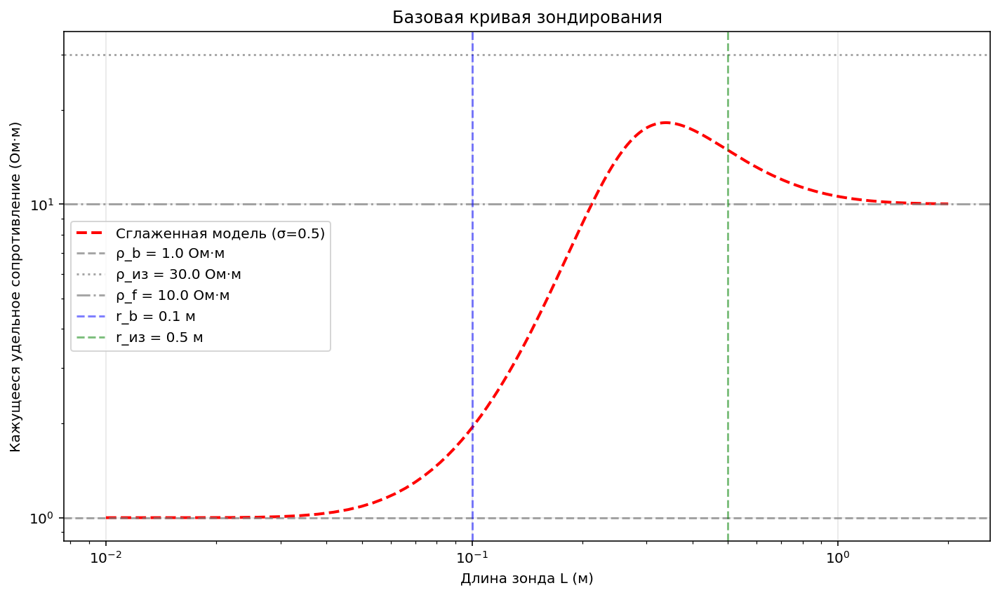

# Исследование чувствительности прямой задачи электрокаротажа

## Цель работы

Целью данной работы является исследование чувствительности прямой задачи электрокаротажа к изменениям параметров модели среды.

Рассматривается радиальная трехзонная модель:

- скважина
- зона проникновения
- пласт

## Базовые параметры модели

- ρ_b = 1 Ом·м — сопротивление скважины
- ρ_из = 30 Ом·м — сопротивление зоны проникновения
- ρ_f = 10 Ом·м — сопротивление пласта
- r_b = 0.1 м — радиус скважины
- r_из = 0.5 м — радиус зоны проникновения

## Этапы расчета

1. Вычисление сигнала зонда для базовой модели.
2. Изменение параметра ρ_из и анализ зависимости сигнала от этого параметра.
3. Вычисление абсолютной и относительной чувствительности по ρ_из.
4. Изменение параметра r_из и анализ зависимости сигнала от этого параметра.
5. Вычисление абсолютной и относительной чувствительности по r_из.
6. Сравнение чувствительности для зондов разной длины.
7. Анализ возможности радиального зондирования.

## Основные результаты

- Сигнал нелинейно зависит от параметров зоны проникновения.
- Максимальная чувствительность наблюдается в определенных диапазонах параметров.
- Короткие зонды более чувствительны к приствольной зоне.
- Длинные зонды лучше чувствуют удаленную часть пласта.

## Вывод

Проведенный численный анализ показывает, что чувствительность сигнала существенно зависит от параметров зоны проникновения и длины зонда. Это подтверждает возможность использования зондов различной длины для исследования радиальной структуры среды.

## Следующий этап

На следующем этапе планируется:

- исследование глубины исследования зондов
- анализ эквивалентности моделей
- подготовка к решению обратной задачи

## Графики

### Сигнал как функция ρ_из

### Абсолютная чувствительность к ρ_из

### Относительная чувствительность к ρ_из

### Сигнал как функция r_из

### Абсолютная чувствительность к r_из

### Относительная чувствительность к r_из

### Сравнение зондов разной длины по ρ_из

### Сравнение зондов разной длины по r_из

### Базовая кривая зондирования
